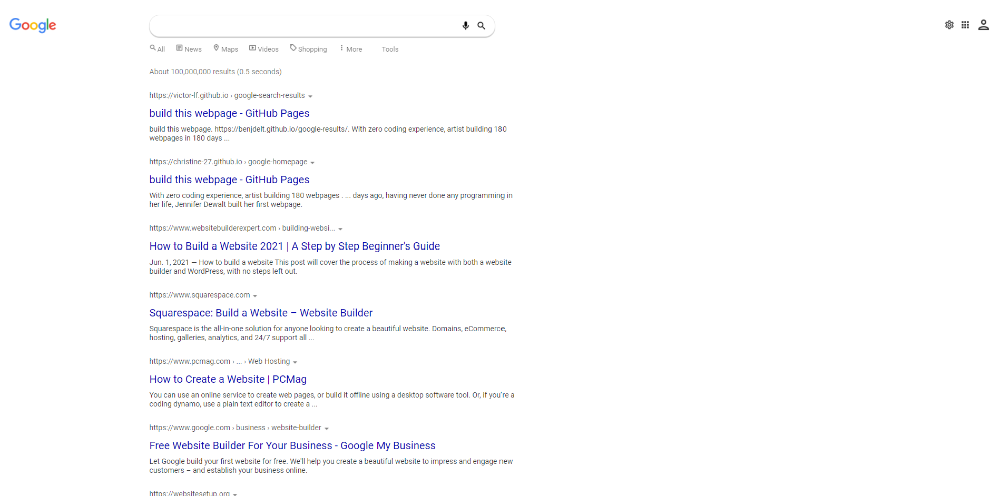
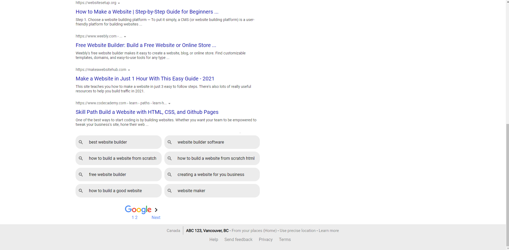

<h1>Google Search Page Copy</h2>

<h3>Description</h3>

One of the final projects for the <a href="https://www.theodinproject.com/paths/foundations?">Foundations in Web Development course by The Odin Project</a> is recreating the Google search page using HTML and CSS. I recreated the page without looking at the code and iteratively working towards replicating the design of the page.

Below is a screenshot of the page: 
<h3>Top</h3> 
 
<h3>Bottom</h3> 
 
